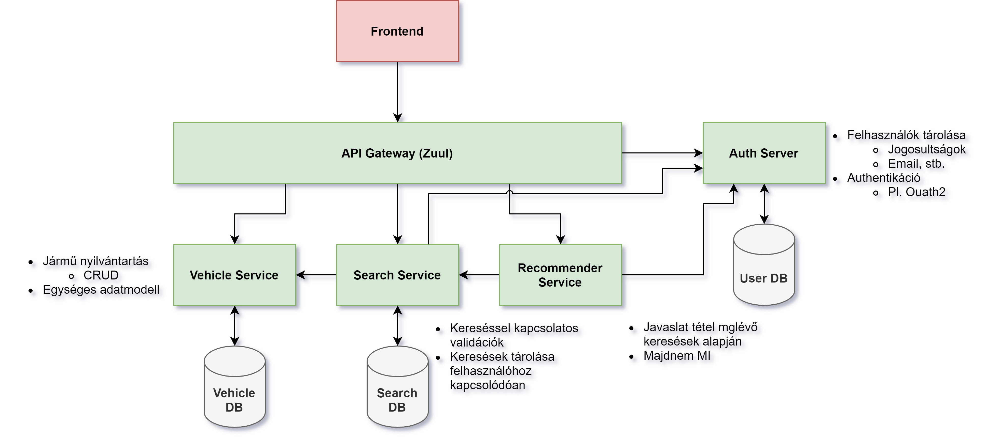

# Car-searcher
This project was created as a [BSc Thesis Work](https://www.aut.bme.hu/Education/BScInfo/Szakdolgozat) at Budapest University of Technology and Economics.

Consultant: [Jánoky László Viktor BME-AUT](https://www.aut.bme.hu/Staff/jlaci) 

# Developing a microservices application for vehicle configuration
When making the purchase of a new car, people tend to ignore metrics carefully selected by manufacturers and the industry and just simply make this decision based on their emotions. It is not in the interest of car manufacturers to try adapting to another manufacturer. On the other hand, they usually easily enter into agreements with independent partners. Taking advantage of this willingness, my thesis provides a solution to the problem presented earlier. This document presents a website where users can search, browse, and request recommendations among cars.
The project is based on the already well-known and widely used microservices architecture. As a result, the application is stable, scales well and is easy to maintain and improve. The task is implemented in Java, using the Spring framework.
The thesis presents the whole development process. From defining the requirements, through the design, to the development process, which we conclude with the evaluation. I consider the clear determination of requirements and the proper execution of the planning to be of paramount importance, as it is also easier to implement a well-defined, flexible system.

## User stories
|As a |I want |so that|
|:---|:---|:---|
|Visitor |filtering by parameters|I can search vehicles|
|Visitor |a comparator page|I can compare vehicles|
|User |everything *visitor* has | |
|User |login| I can save my searches|
|User |to make statistics from my saved searches| I can get recommendations|
|Manufacturer |admin page|I can add or edit my vehicles|
 
## Architektúra 

